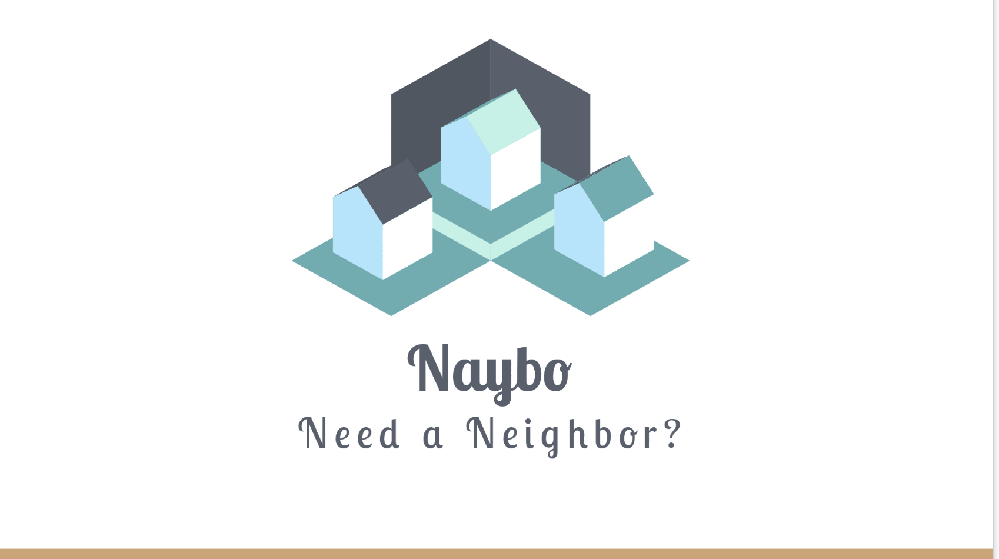

# Naybo
Full stack application that uses an API for entering, saving and retrieving data.

### Welcome to the Neighborhood...
This project is an excercise in writing a full stack application and in creating an API which connects with a database to store and retrieve data. 

#### Won't you be my neighbor?
 The concept behind this API is a tool sharing network of rentable items. Think of this as a prototype for a real world application in which you can borrow stuff from your neighbors or you can post your own stuff for your neighbors to borrow. 

## How it Works
### Setting up
On the Front end Naybo requires:
* HTML
* CSS
* JavaScript
* Bootstrap

Behind the scenes Naybo requires: 
* Node.js
* Express
* Handlebars
* MySQL
* Sequelize
* JawsDB
* Amazon S3

#### Features
The application has multiple functionalities. New users can create an account. Users are then stored in a database and validated upon login. The Item API works with the database to give users the ability to add, search and retreive items. 

The main functionalities are:
* Allow account creation for Users
  * Name, username, email, password, city and state
* CRUD functionality for Items
  * Create and add items to the database
  * Retreive all items or search for specific items
  * Update item information
  * Delete an item
* Display availability of Items
  * When a user is contacted about their item being borrowed, they can change it's state from "available" to "unavailable". It will no longer appear in the search 

### Future Possibilities
Ideas for additional features to include are:
* Messaging system for users to communicate within the site itself
* Calendar to display when items are available or unavailable

### Heroku Deployment
The functioning website is deployed to Heroku <a href="https://apple-cobbler-47548.herokuapp.com/">HERE</a>

### Your Friendly Neighborhood Developers
Kelly Davis - <a href="https://github.com/kad1001">GitHub</a>  
Worthy Gardner - <a href="https://github.com/theworthyg">GitHub</a>  
Jennifer Gingras - <a href="https://github.com/jennifergingras">GitHub</a>   
Eric Seipold - <a href="https://github.com/sullyseipold">GitHub</a>  
Miranda Wozmak - <a href="https://github.com/mirwoz">GitHub</a> 